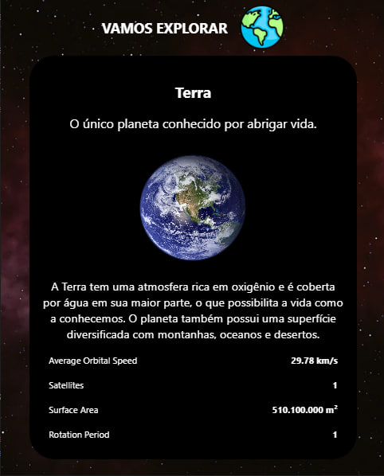

# Sistema Solar - App Interativo

Este é um projeto de um aplicativo interativo desenvolvido em **React Native**, que permite aos usuários explorar os planetas do Sistema Solar. O usuário pode navegar entre os planetas utilizando botões de "Próximo" e "Anterior", visualizando informações básicas sobre cada planeta.

## Funcionalidades

- Navegação entre planetas.
- Exibição de informações de cada planeta.
- Interface simples e intuitiva.
- Animação de fundo temática do espaço.

## Capturas de Tela



## Tecnologias Utilizadas

- **React Native**: Framework principal utilizado para o desenvolvimento da interface do aplicativo.
- **JavaScript (ES6+)**: Linguagem de programação principal.
- **Hooks (useState)**: Para gerenciar o estado dos componentes.
- **Componentes React Native**: 
  - `SafeAreaView`: Para garantir que o conteúdo do app seja renderizado dentro de áreas seguras do dispositivo.
  - `View` e `ScrollView`: Para estruturar e rolar o conteúdo da interface.
  - `TouchableOpacity`: Para criar botões interativos.
  - `ImageBackground` e `Image`: Para exibir imagens de fundo e o logotipo.
  - `Text`: Para exibir textos no app.

## Estrutura do Projeto

- **App.js**: Arquivo principal onde ocorre a renderização da aplicação.
- **Planeta.js**: Componente responsável por renderizar as informações de cada planeta.
- **planetas.js**: Contém um array de objetos representando os planetas do Sistema Solar, com suas respectivas informações.
- **assets/**: Contém imagens e recursos gráficos usados no projeto (ex: fundo do espaço, logotipo).

## Como Executar o Projeto

Siga os passos abaixo para executar o projeto localmente:

1. Clone o repositório para o seu ambiente local:
   ```bash
   git clone https://github.com/DEVinHouse-Clamed-V3/app-sistema-solar-LeoRVergani.git
   ```

2. Navegue até o diretório do projeto:
   ```bash
   cd app-sistema-solar-LeoRVergani
   ```

3. Instale as dependências do projeto:
   ```bash
   npm install
   ```

4. Execute o aplicativo no emulador ou dispositivo físico:
   ```bash
   npx react-native run-android # para Android
   npx react-native run-ios # para iOS
   ```

## Como Usar

- **Navegação entre planetas**: Utilize os botões "Anterior" e "Próximo" para navegar entre os planetas do Sistema Solar e visualizar suas informações.
- **Interface responsiva**: O app é otimizado para diferentes tamanhos de tela.

## Contribuição

Se quiser contribuir com melhorias ou novas funcionalidades, sinta-se à vontade para abrir um *pull request* ou enviar sugestões.

## Licença

Este projeto está licenciado sob a licença MIT - veja o arquivo [LICENSE](LICENSE) para mais detalhes.

### Principais pontos abordados no `README.md`:

1. **Descrição geral do projeto**.
2. **Funcionalidades principais** do aplicativo.
3. **Tecnologias utilizadas**, destacando React Native, hooks e componentes principais.
4. **Instruções para instalação e execução** do projeto localmente.
5. **Informações de como contribuir** com o projeto.
